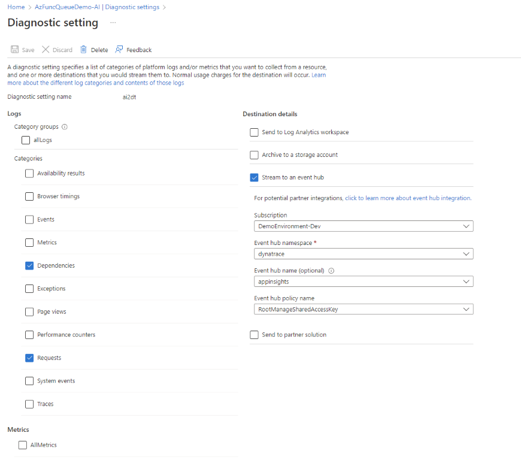
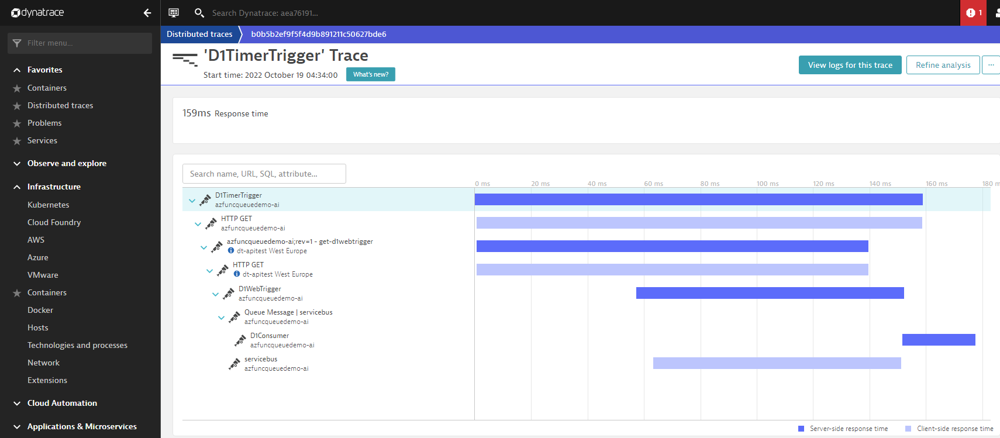

# Application Insights Exporter for OpenTelemetry

The Application Insights Exporter allows to read traces exported from Azure Application Insights via Azure EventHub and converts/forwards to an OpenTelemetry OTLP compatible endpoint. 

## How does it work?
The project provides an Azure Function, bound to an EventHub from which it receives, converts and forwards the telemetry. 

Supported [Application Insights telemetry types](https://learn.microsoft.com/en-us/azure/azure-monitor/app/data-model) are: 
* AppDependency
* AppRequests

Supported OpenTelemetry formats are: 
* [OTLP/HTTP JSON format](https://opentelemetry.io/docs/reference/specification/protocol/otlp/#otlphttp)

## Getting Started

### Pre-Requisites
* Create or configure an Azure EventHub with the name "appinsights" to which you want forward the telemetry from your Application Instance. 
* If your target backend doesn't support OLTP/HTTP JSON format, you can use an [OpenTelemetry Collector](https://opentelemetry.io/docs/collector/) as a receiving endpoint for the Application Insights Exporter. 

### Sending trace telemetry 
Configure Diagnostic settings of your Application Insights instance from which you want to forward the telemtry. 
* Check **Dependencies** and **Requests**  in the telemetry catgories (all other categories will be ignored when processing) 
* Check the **Stream to an event hub** and select your previously configured eventhub. 



### Running the forwarder locally
1. Configure **local.settings.json**
```
{
  "IsEncrypted": false,
  "Values": {
    "AzureWebJobsStorage": "UseDevelopmentStorage=true",
    "FUNCTIONS_WORKER_RUNTIME": "dotnet",
    "EHConnection": "<YourEventHubConnectionString",
    "OTLP_ENDPOINT": "http://localhost:4318/v1/traces"
  }
}
```
* Replace the value of **EHConnection** with the connection string to read from your configured eventhub. Read more about here, [how to get an Event Hubs connection string](https://learn.microsoft.com/en-us/azure/event-hubs/event-hubs-get-connection-string)
* Configure the **OTLP_ENDPOINT* to point to your targeted OLTP/HTTP JSON compatible endpoint. By default it's an local endpoint configured for testing. 

2. Run your Function

For more details how to run an Azure Function locally see [Code and test Azure Functions locally](https://learn.microsoft.com/en-us/azure/azure-functions/functions-develop-local)


### [Optional] Run an OpenTelemetry Collector 
The project contains a collector config **otel_collector_config.yaml**, configured with a pipeline for an OTLP/HTTP binary format requiring an authorization token. It allows to pass the receiving OTLP endpiont and an authorization token via environment variables. 
```
receivers:
  otlp:
    protocols:
      http:
exporters:
  otlphttp:
    endpoint: "${OTLPHTTP_ENDPOINT}"
    headers: {"Authorization": "Api-Token ${API_TOKEN}"}
service:
  pipelines:
    traces:
      receivers: [otlp]
      processors: []
      exporters: [otlphttp]
```

Now run the standard OpenTelemetry collector image from Docker-Hub [otel/opentelemetry-collector-contrib](https://hub.docker.com/r/otel/opentelemetry-collector-contrib), dynamically passing over necessary configuration.

Windows
```
docker run -p 4318:4318  -e OTLPHTTP_ENDPOINT="<Your-receiving-OTLP-endpoint>" -e API_TOKEN="<Your-api-token>" -v %cd%/otel_collector_config.yaml:/etc/otel/config.yaml otel/opentelemetry-collector-contrib
```

Linux
```
docker run -p 4318:4318  -e OTLPHTTP_ENDPOINT="<Your-receiving-OTLP-endpoint>" -e API_TOKEN="<Your-api-token>" -v $(pwd)/otel_collector_config.yaml:/etc/otel/config.yaml otel/opentelemetry-collector-contrib
```

**Note**: Replace *&lt;Your-receiving-OTLP-endpoint&gt;* and *&lgt;Your-api-token&gt;* with the values matching your trace backend's configuration

### Original Trace in Application Insights


### Exported Trace in Dynatrace


## Release Notes
v0.1.0 - Initial release supporting AppDependency, AppRequests mapped and forwarded to OTLP/HTTP JSON

## Contribute
This is an open source project, and we gladly accept new contributions and contributors.  

## License
Licensed under Apache 2.0 license. See [LICENSE](LICENSE) for details.

